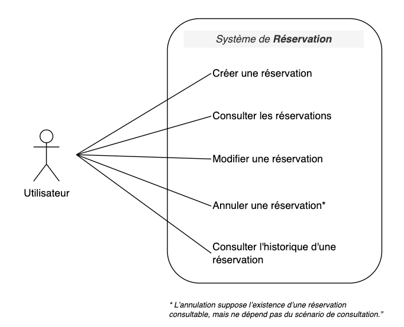
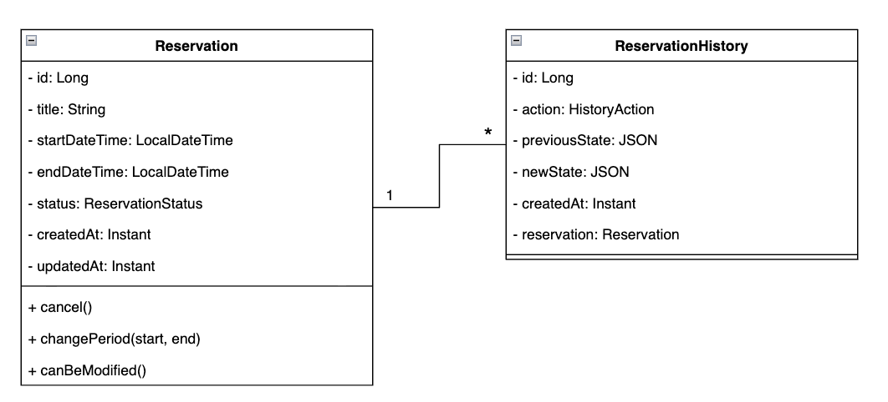

<br><br>
# 📅 Reservation API – Spring Boot (en cours)

## 🎯 Présentation

Ce projet est une **API backend** simple de gestion de réservations de créneaux, développée en Java avec **Spring Boot**.

L'objectif n'est pas de construire une application complète, mais de **modéliser proprement un domaine métier**, de mettre en œuvre des règles de gestion réalistes, et de montrer une approche structurée et raisonnée du développement backend.

Le périmètre est **volontairement limité** afin de rester concentrée sur :

- la logique métier
- la modélisation
- la lisibilité du code
- la traçabilité des changements

---

## 💡 Intention du projet

Ce projet est conçu comme un **mini-projet**, avec les intentions suivantes :

- Utiliser **Spring Boot** sur un cas métier concret
- Travailler une **modélisation orientée domaine** (entités, règles, statuts)
- Éviter la sur-architecture (pas de micro-services inutiles)
- Assumer des **choix de périmètre clairs et justifiés**

> ⚠️ Certaines fonctionnalités courantes (authentification, rôles, notifications…) ne sont **pas implémentées volontairement** et sont considérées hors scope pour cette version.

---

## 📋 Cas d'usage (Use Case)

[](usecase_diagram)

Ce projet couvre les cas d'usage suivants :

[  ] Créer une réservation sur un créneau donné  
[  ] Consulter les réservations existantes  
[  ] Modifier une réservation (si elle est modifiable)  
[  ] Annuler une réservation (changement de statut, pas de suppression)  
[  ] Consulter l'historique des modifications d'une réservation

Les **règles métier** garantissent la cohérence des données (non-chevauchement, statuts, dates passées, etc.).

---

## 🗂️ Diagramme de classes

[](UML_Class_diagram)

Le domaine repose sur **deux entités principales** :

- `Reservation`
- `ReservationHistory`

**La relation est de type ```one-to-many``` :**

```
1 Reservation → * ReservationHistory
```

L'historique permet de conserver une **trace explicite** des changements effectués sur une réservation (création, modification, annulation).

---

## 🧩 Entités

### `Reservation`

- intervalle de temps (`startDateTime`, `endDateTime`)
- statut (`CONFIRMED`, `CANCELLED`) en ENUM
- règles métier intégrées à l'entité
- pas de logique CRUD dans l'entité

### `ReservationHistory`

- action effectuée (`CREATE`, `UPDATE`, `CANCEL`) en ENUM
- état précédent / nouvel état (stockés sous forme JSON)
- date de création
- lien vers la réservation concernée

> 💡 La création des entrées d'historique est gérée au niveau du **service**, afin de respecter la séparation des responsabilités.

---

## ⚙️ Règles métier principales

- Une réservation est définie par un **intervalle de temps**
- Deux réservations ne peuvent **pas se chevaucher**
- Une réservation **passée** ne peut pas être modifiée
- Une réservation **annulée** ne peut plus être modifiée
- L'annulation se fait par **changement de statut**, pas par suppression
- Toute création ou modification entraîne la création d'une **entrée d'historique**

---

## 🚧 Hors scope

Les éléments suivants ne sont **pas implémentés** dans cette version :

- authentification / autorisation
- gestion des utilisateurs
- rôles (admin / user)
- notifications (email, SMS…)
- interface frontend avancée
- gestion multi-ressources
- problématiques de performance ou de scalabilité

> Ces choix sont **assumés** afin de conserver un projet lisible, focalisé sur la logique métier.

---

## 🛠️ Stack technique

- ☕ **Java**
- 🍃 **Spring Boot**
- 💾 **Spring Data JPA**
- 🗄️ Base de données relationnelle (PostgreSQL)
- 🔧 **Maven**

---

## 📂 Structure du projet

```
src/main/java
 └── com.example.reservation
     ├── controller
     ├── dto
     ├── service
     ├── repository
     ├── model
     │    ├── Reservation
     │    ├── ReservationHistory
     │    ├── ReservationStatus
     │    └── HistoryAction
     └── exception
```

---

## 🚀 Pistes d'évolutions possibles

Sans modifier le cœur du projet, il pourrait évoluer vers :

- ajout d'une authentification (JWT)
- rattachement des réservations à un utilisateur
- extraction d'un service de notification
- exposition d'un frontend simple
- gestion de plusieurs types de ressources

> Mais pas dans l'immédiat ! 🙂